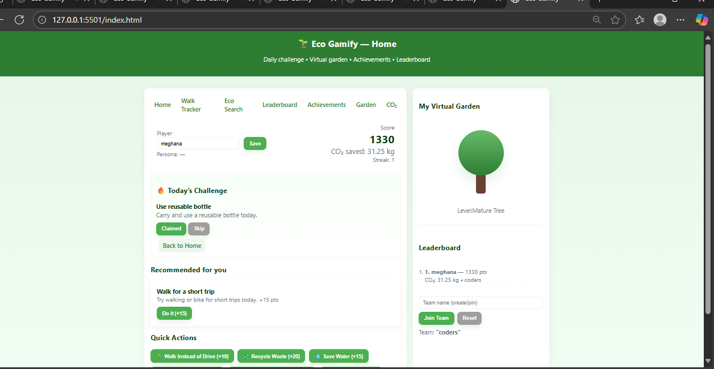
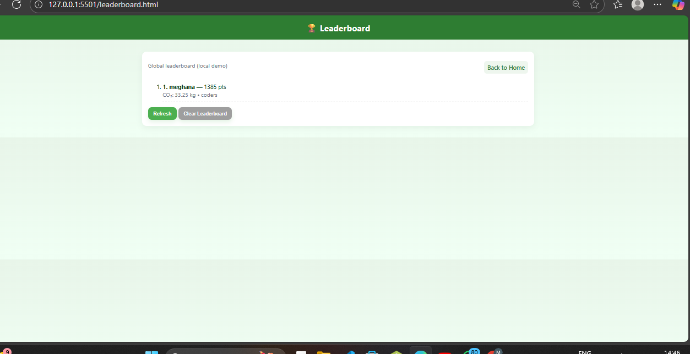
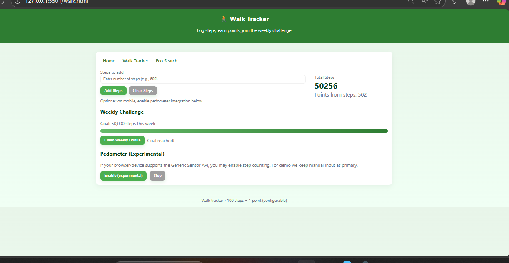
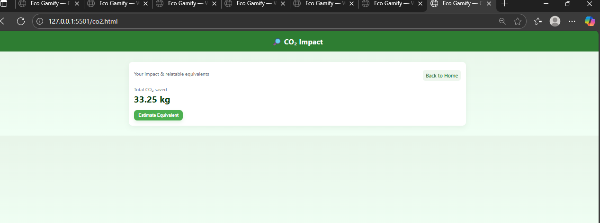
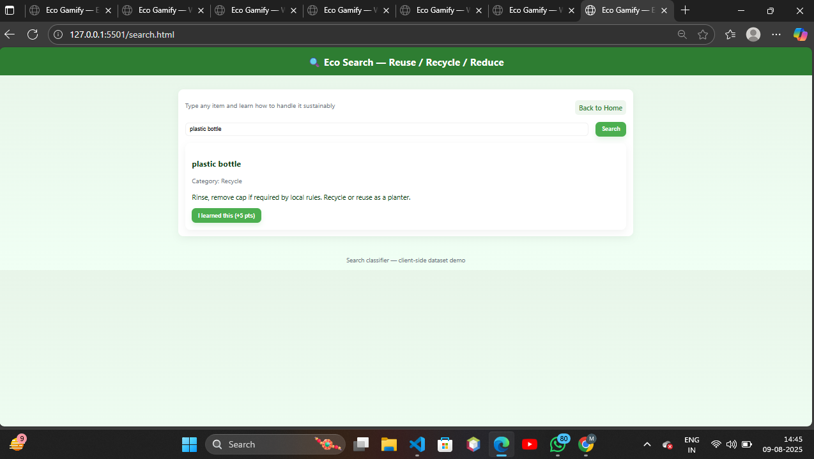

# 🌱 Eco Gamify

## Overview
Eco Gamify is an innovative web application designed to encourage sustainable and eco-friendly habits through gamification. By integrating daily challenges, a virtual garden, step tracking, and a leaderboard system, the platform motivates users to actively participate in environmental responsibility while making it engaging and rewarding.

## Problem Statement
Environmental awareness and action often lack engagement, leading to minimal impact on individual behaviors. Eco Gamify addresses this by transforming eco-friendly practices into fun, interactive activities, incentivizing users with points, achievements, and social competition to foster lasting sustainable habits.
## 👩‍💻 Team Information
  Meghana Sivan — Frontend Developer & Project Lead  
  Girishma G Girish — UI/UX Designer & Content Strategist  
  Rudra A.R — JavaScript Developer & Gamification Engineer  
  Akshara S— Research & Eco Content Curator  

## Features
- **Daily Eco Challenges:** Personalized tasks that promote eco-conscious actions.
- **Virtual Garden:** Grow a digital tree as a visual representation of your progress.
- **Walk Tracker:** Log physical activity that translates into eco points, encouraging clean mobility.
- **Leaderboard:** Compete with others to foster community motivation.
- **Achievements:** Unlock badges and rewards for milestones.
- **CO₂ Savings Calculator:** Track estimated carbon emissions saved through your actions.

## Technology Stack
- **Frontend:** HTML, CSS, JavaScript
- **Backend:** Client-side logic with potential for server integration
- **Storage:** LocalStorage for user data persistence

## How It Works
Users enter their daily sustainable activities and physical steps to earn points. These points contribute to virtual tree growth and leaderboard rankings, providing real-time feedback and motivation. The system rewards consistency and progress with achievements and team challenges.

## Installation & Usage
1. Clone or download the repository.
2. Open `index.html` in any modern web browser.
3. Navigate through features using the menu.
4. Start engaging with daily challenges and track your eco-friendly actions.

## Future Enhancements
- Integration with device sensors for automatic step tracking.
- Backend database for multi-user support and real-time updates.
- Mobile app version for enhanced accessibility.
- Social sharing features to amplify community impact.
  
  ## 📸 Screenshots

---

## 📂 GitHub Repository Link
👉 [View EcoTrackr Project:https://github.com/Meghanasivan/Eco_game.git

## Contribution
Contributions are welcome! Please fork the repository and submit pull requests for improvements or new features.

---

*Eco Gamify empowers individuals to take meaningful steps towards sustainability by blending technology with environmental consciousness.*

